# Parrot OS GRUB Recovery and Partition Expansion - My Real-World Cybersecurity Journey

**Date of Recovery:** July 2, 2026  
**Date of Partition Expansion Attempt:** July 13, 2026  
**Author:** baboucarr  

---

## What This Is

This is not a tutorial. This is a real story of me breaking my system, panicking a little, and then figuring out how to fix it. I am documenting this because I believe the best way to learn cybersecurity is to break things and then fix them. Every error message is a teacher.

I am a cybersecurity student. I dual-boot Windows and Parrot Security OS. One day, my GRUB bootloader just died. Gone. Corrupted. I could not boot into Parrot anymore. This is what happened next.

---

## The Setup

Before we begin, here is what my disk looked like when everything went wrong:

- 256GB Micron 1100 SATA SSD
- Windows taking up 168.4GB (NTFS)
- Parrot Security OS at 52.2GB (BTRFS with subvolumes)
- A tiny 100MB EFI partition
- A 7.8GB Windows recovery partition

I wanted more space for Parrot because 52GB is not enough when you are running a security-focused distro with VMs, tools, and datasets.

---

## Phase 1: The GRUB is Dead

### July 2, 2026 - The Day It All Started

I booted my laptop and instead of the familiar GRUB menu with Parrot and Windows options, I got nothing. Just a black screen or some error. My heart sank. All my tools, my notes, my custom configs - everything was on that Parrot partition.

I had heard about SystemRescue before. It is a Linux rescue toolkit that boots from USB. I decided this was my only hope.

### Creating the Rescue USB

I downloaded SystemRescue ISO and flashed it to a USB using balenaEtcher. Then I rebooted, spammed F12, and selected the USB drive. SystemRescue booted successfully. I felt a small wave of relief.

### Finding My Partitions

Once in SystemRescue, I opened a terminal and ran the classic:

```bash
fdisk -l
```

This showed me my disk layout. Here is what I saw:


My Parrot partition was /dev/sda4 at 52.2GB. The filesystem type said "Linux filesystem" which was correct.

### The First Mistake: Simple Mounting

I thought I could just mount the partition like any normal Linux system. So I tried:

```bash
mkdir -p /mnt/parrot
mount /dev/sda4 /mnt/parrot
```

It failed. Why? Because Parrot uses BTRFS with subvolumes. I had to specify the subvolume with `@`.

```bash
mount -o subvol=@ /dev/sda4 /mnt/parrot
```

That worked! I could see my files. The relief was real.


### The Chroot Nightmare

Now I needed to enter my Parrot system to reinstall GRUB. The standard way is chroot. So I tried mounting the virtual filesystems:

```bash
mount --bind /dev /mnt/parrot/dev
mount --bind /proc /mnt/parrot/proc
mount --bind /sys /mnt/parrot/sys
```

But SystemRescue was acting weird. The shell kept throwing errors about missing files in /proc/sys/kernel/random/. It was like the system was half-broken. I later realized SystemRescue's own proc was incomplete.

When I finally chrooted and ran grub-install, it failed with:

```
grub-install: error: cannot find a device for /boot/grub (is /dev mounted?)
```

I was frustrated. I had followed the standard procedure. Why was it not working?


### The Breakthrough: Fresh Mounts

After a lot of trial and error (and some Googling in my head), I realized that binding SystemRescue's broken virtual filesystems into the chroot was the problem. I needed fresh mounts.

I unmounted everything and started over:

```bash
umount -R /mnt/parrot
mount -o subvol=@ /dev/sda4 /mnt/parrot
mount -t devtmpfs devtmpfs /mnt/parrot/dev
mount -t proc proc /mnt/parrot/proc
mount -t sysfs sysfs /mnt/parrot/sys
mount -t tmpfs tmpfs /mnt/parrot/run
```

This was the key insight. Fresh devtmpfs, proc, sysfs, and tmpfs mounts instead of bind mounts. The difference is that bind mounts copy the host's view, but fresh mounts create a new clean environment inside the chroot.

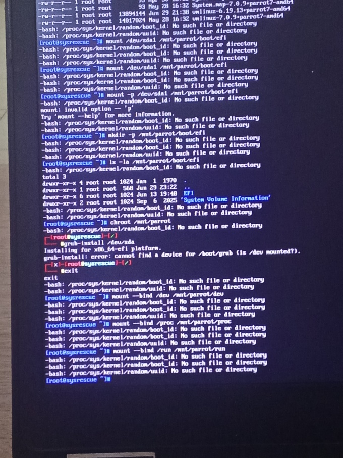

### The EFI Directory Problem

I chrooted again and ran grub-install. New error:

```
grub-install: error: cannot find EFI directory
```

Okay, so /dev was working now, but GRUB could not find the EFI partition. I had to mount it inside the chroot:

```bash
mkdir -p /boot/efi
mount /dev/sda1 /boot/efi
```

Then I ran grub-install again. And finally...

```
Installing for x86_64-efi platform.
grub-install: warning: EFI variables cannot be set on this system.
grub-install: warning: You will have to complete the GRUB setup manually.
Installation finished. No error reported.
```

YES. It worked. I almost shouted.

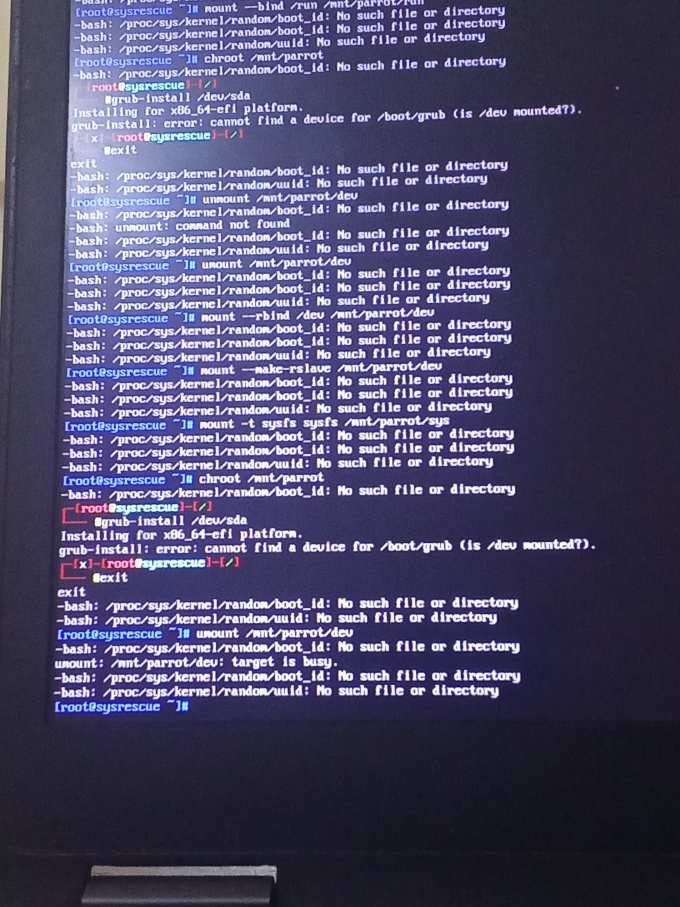

### Updating GRUB Configuration

With GRUB reinstalled, I needed to regenerate the config so it would detect both Parrot and Windows:

```bash
update-grub
```

It found both my Parrot kernels and even detected Windows. The output was beautiful:

```
Generating grub configuration file ...
Found background image: /usr/share/images/desktop-base/desktop-grub.png
Found linux image: /boot/vmlinuz-7.0.9+parrot7-amd64
Found initrd image: /boot/initrd.img-7.0.9+parrot7-amd64
Found linux image: /boot/vmlinuz-6.19.13+parrot7-amd64
Found initrd image: /boot/initrd.img-6.19.13+parrot7-amd64
Adding boot menu entry for UEFI Firmware Settings ...
done
```

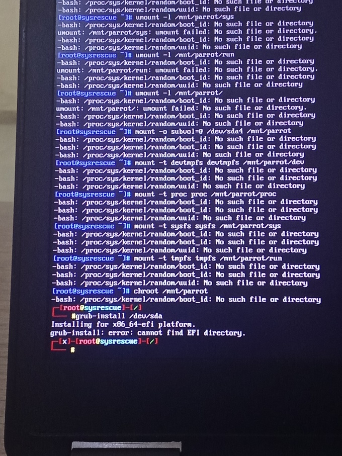

There was a small warning about not being able to find a GRUB drive for /dev/sdb1 (the USB), but that was irrelevant.

### The Reboot

I exited the chroot and rebooted:

```bash
exit
reboot
```

I removed the USB. My heart was racing. Would it work?

The screen lit up. The GRUB menu appeared. I selected Parrot OS. And there it was - my desktop, my wallpaper, my files. Everything was intact.

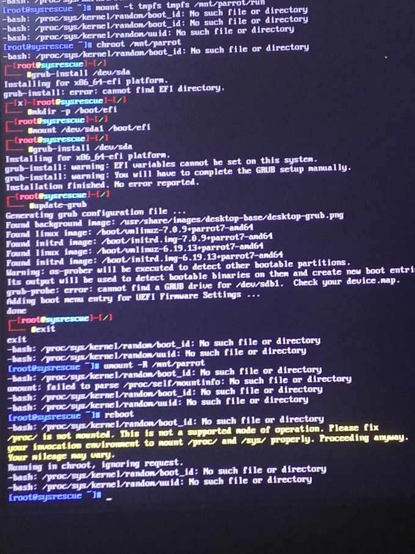

I had done it. I fixed my own bootloader. The feeling was incredible.

---

## Phase 2: I Want More Space - July 13, 2026

### The Problem

52GB for Parrot is not enough. I have security tools, virtual machines, datasets, and I want to do more. My Windows partition was taking 168GB and I barely use Windows except for a few things.

My plan was:
1. Reset Windows while keeping my files (to clean up space)
2. Shrink the Windows partition
3. Expand Parrot into the freed space

### Attempt 1: Reset Windows

I went to Settings -> System -> Recovery -> Reset this PC. I chose "Keep my files." But I got an error:

> "Could not find recovery environment"

I opened Command Prompt as admin and ran:

```cmd
reagentc /enable
```

It returned:

```
REAGENTC.EXE: The Windows RE image was not found.
```

The Windows Recovery Environment was completely missing. This meant I could not reset Windows through the built-in tool. I would need a Windows installation USB to do a reset, which I did not have at the moment.

### Attempt 2: Just Shrink Windows Directly

I decided to skip the reset and just shrink the Windows partition directly. I had already freed up about 25GB in Windows by deleting files and running Disk Cleanup.

I opened AOMEI Partition Assistant to examine the disk. Here is what I saw:

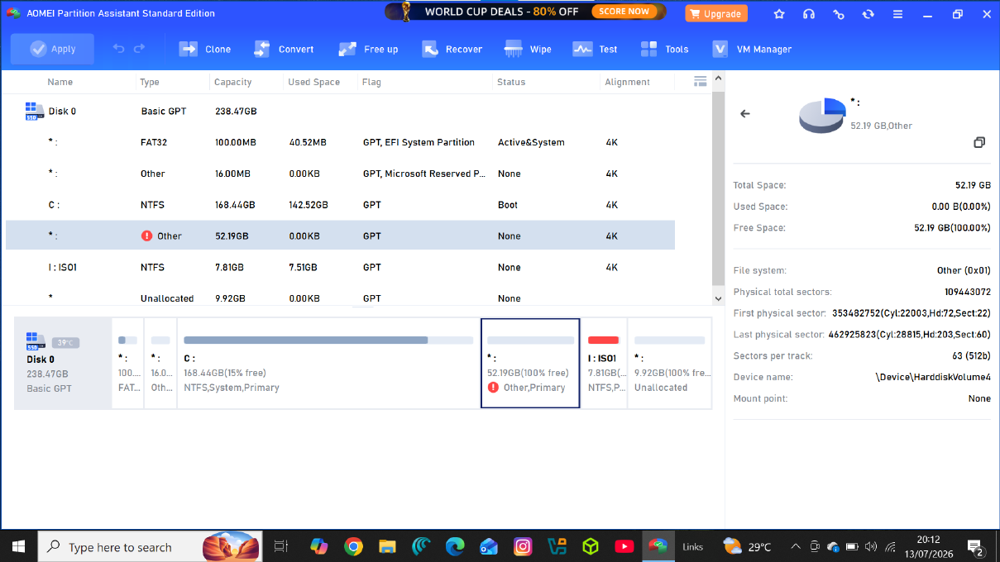


Something weird caught my eye. AOMEI showed my Parrot partition (52.19GB) as "Other" with 0 bytes used and 100% free. That was wrong. I knew my Parrot partition was full of data.

Then I realized: **AOMEI Partition Assistant Standard (free version) does not support BTRFS filesystems.** It could not read the BTRFS partition, so it assumed it was empty. This was an important lesson - not all partition tools understand all filesystems.

I checked Windows Disk Management to see the real layout:

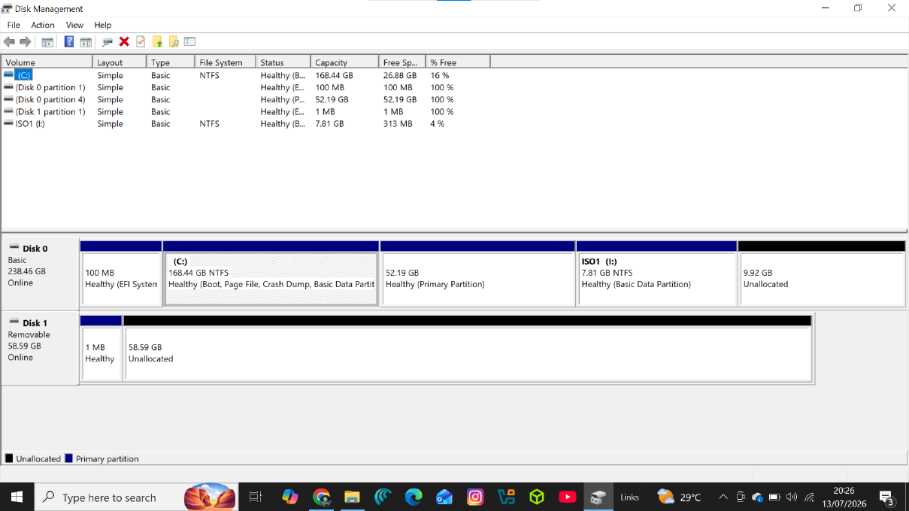

The layout was:
- C: drive - 168.44GB NTFS with 25.52GB free
- Parrot - 52.19GB (shown as Healthy Primary Partition)
- ISO1 (I:) - 7.81GB (this was actually my USB showing up)
- 9.92GB Unallocated

Wait, the USB was showing as a drive letter? That was strange.

### The USB Data Recovery Side Quest

I remembered I had backed up about 17GB of files to a USB drive before all this started. But when I plugged in the USB, I could not see my files. The USB only showed as "ISO1" with 7.81GB.

Then it hit me. When I created the SystemRescue bootable USB, I had used this same USB. Flashing the ISO overwrote everything on it. My 17GB of backups were gone. I felt stupid for a moment, but then I thought - this is also a learning opportunity.

I tried Recuva first:

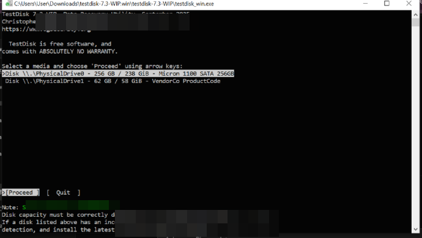

I selected "On my media card or iPod" but did not complete the deep scan. I realized a quick scan would not find anything because the partition table was completely overwritten by the ISO flash.

Then I tried TestDisk, which is more powerful for partition recovery:


TestDisk found my USB (PhysicalDrive1 - 62GB). It showed multiple partitions including a 53GB Linux partition. I checked the files:

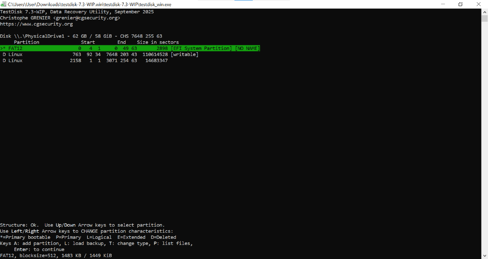

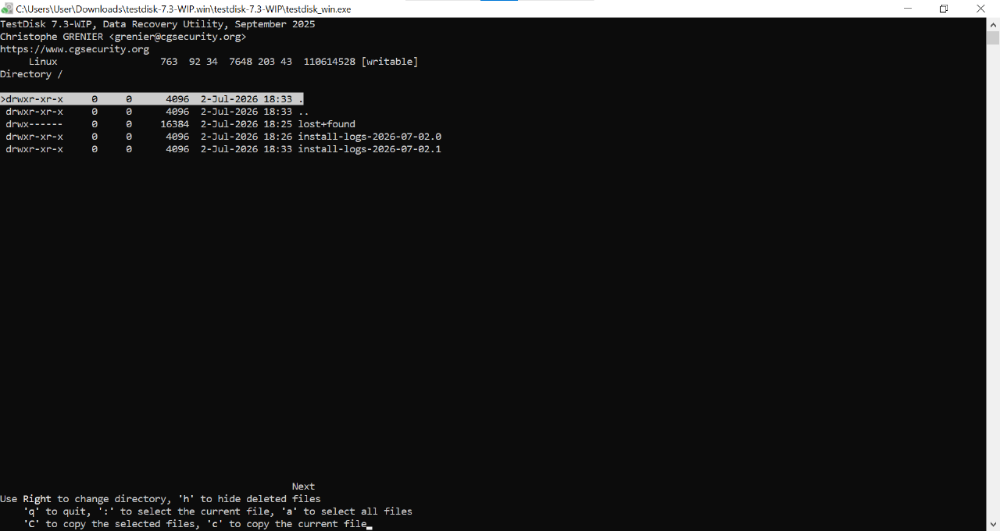

The files it found were just SystemRescue installation logs from July 2, 2026 - the day I created the bootable USB. My personal files were not there. The ISO flash had completely destroyed them.

I went back to check other partitions:


The conclusion was clear. The data was unrecoverable because the ISO write process is a low-level disk overwrite operation. It does not just delete files - it replaces the entire disk structure.

I checked File Explorer and Disk Management one more time:

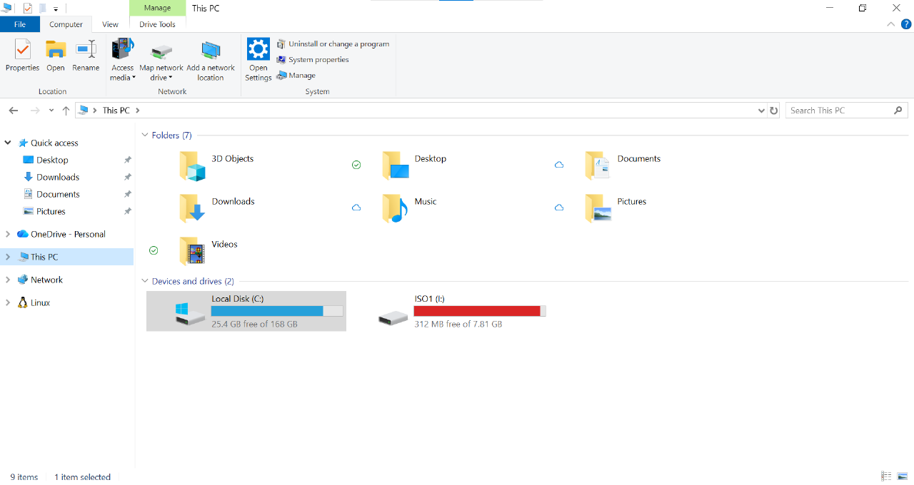

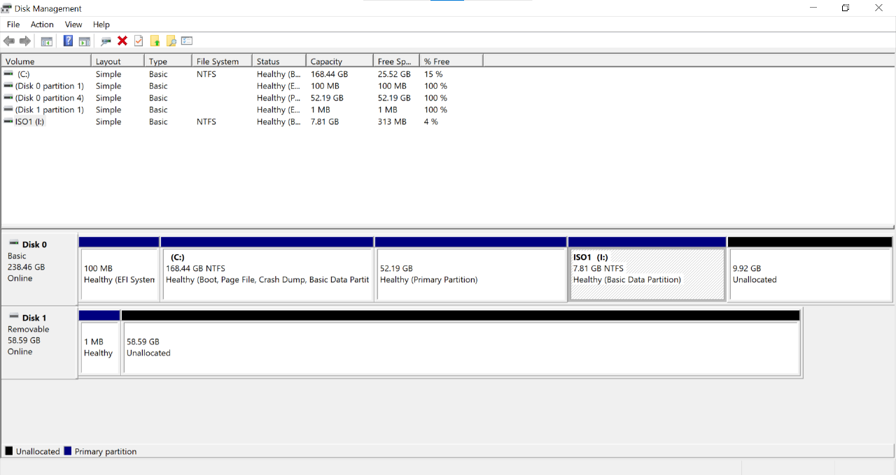

The USB showed 58.59GB as "Unallocated" in Disk Management, with only a tiny 1MB partition and the 7.81GB ISO1 partition. The rest was empty space.

I decided to let go of the 17GB. It was a painful but necessary lesson.

### What I Learned From This Side Quest

1. **Never flash an ISO over a USB that has important data.** Always use a dedicated, empty USB for bootable media.
2. **ISO flashing is destructive.** It is not like copying files. It overwrites the entire disk at the block level.
3. **Recovery tools have limits.** TestDisk and Recuva are amazing, but they cannot recover data that has been physically overwritten by new data.

---

## The Current State

As of July 13, 2026, here is where I stand:

- **Parrot OS is booting perfectly** - GRUB was successfully reinstalled
- **Windows is still at 168GB** - I freed up 25GB inside it but have not shrunk the partition yet
- **The 9.92GB Unallocated space** is still sitting next to the recovery partition
- **My USB is reformatted** - I reclaimed the full 58GB but lost 17GB of backups

My next steps will be:
1. Boot SystemRescue again
2. Use GParted (not AOMEI) to shrink the Windows NTFS partition
3. Expand the Parrot BTRFS partition into the freed space
4. Reinstall GRUB if needed after partition changes

---

## Key Commands Reference

Here are the exact commands that saved my system, in order:
 
```bash
# Boot SystemRescue and find partitions
fdisk -l

# Mount Parrot BTRFS root with subvolume
mkdir -p /mnt/parrot
mount -o subvol=@ /dev/sda4 /mnt/parrot

# Mount FRESH virtual filesystems (not bind mounts!)
mount -t devtmpfs devtmpfs /mnt/parrot/dev
mount -t proc proc /mnt/parrot/proc
mount -t sysfs sysfs /mnt/parrot/sys
mount -t tmpfs tmpfs /mnt/parrot/run

# Enter the system
chroot /mnt/parrot

# Mount EFI partition inside chroot
mkdir -p /boot/efi
mount /dev/sda1 /boot/efi

# Reinstall GRUB
grub-install /dev/sda

# Update configuration
update-grub

# Exit and reboot
exit
reboot
```

---

## Reflections

This whole experience taught me more about Linux systems than any tutorial could. I learned:

- How BTRFS subvolumes work and why they need special mounting
- Why chroot needs proper virtual filesystems and what happens when they are broken
- The difference between bind mounts and fresh filesystem mounts
- How EFI bootloaders work and why GRUB needs the EFI partition
- That partition tools have filesystem limitations (AOMEI cannot read BTRFS)
- The destructive nature of ISO flashing
- That I can fix my own system when it breaks

The feeling of seeing my Parrot desktop boot up after hours of troubleshooting was one of the most satisfying moments of my cybersecurity journey so far. It was not just about fixing a computer. It was about proving to myself that I can handle problems under pressure.

I am excited to continue this journey. Breaking things and fixing them is how you really learn.

---

*Written by baboucarr on August 2, 2026. This is a living document - I will update it as I complete the partition expansion.*
